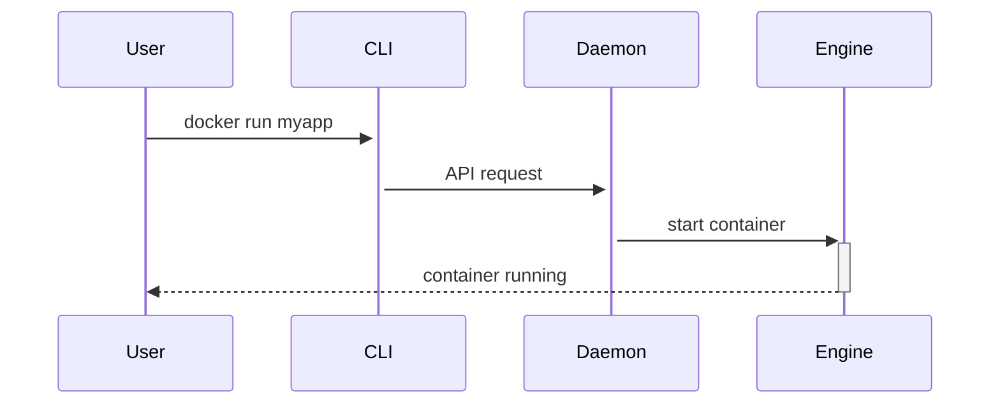

Docker হচ্ছে কনটেইনারিকরণ এক্সোসিস্টেম — এর ভিত্তি চালনা করে তিনটি অংশ: Docker Engine, Docker Daemon ও Docker CLI। এই পাতায় আমরা প্রত্যেকটির কিভাবে কাজ করে, কেন আলাদা তা সহজ বাক্যে ব্যাখ্যা করব এবং কিছু প্রাকটিক্যাল কمان্ড ও ট্রাবলশুটিং টিপস দেব।

## সারাংশ

শর্ট ভার্সন: CLI = আপনি যেটি টাইপ করেন, Daemon = ব্যাকগ্রাউন্ড সার্ভার যা নির্দেশ গ্রহণ করে, Engine = যেটি কনটেইনার বাস্তবে চালায় ও ম্যানেজ করে।

---

## ১। Docker CLI — আপনার ইন্টারফেস

- কী: `docker` কমান্ড লাইন টুল। এটি Docker Daemon-কে HTTP/socket কল করে নির্দেশ দেয়।
- কেন গুরুত্বপূর্ণ: CLI দিয়েই আপনি image বানানো, কনটেইনার চালানো, লগ দেখা, ও নেটওয়ার্ক/ভলিউম ম্যানেজ করতে পারবেন।
- টিপস:
    - `docker --help` ও `docker <command> --help` দেখুন।
    - CLI ব্যবহার করে automation স্ক্রিপ্ট তৈরি করলে CI/CD সহজ হয়।

প্রাথমিক কমান্ড (উদাহরণ):

```bash
docker build -t myapp:latest .
docker run -d --name web -p 3000:3000 myapp:latest
docker ps
docker logs web
```

---

## ২। Docker Daemon (dockerd) — ব্যাকগ্রাউন্ড সার্ভিস

- কী: Daemon হলো ব্যাকগ্রাউন্ড প্রসেস (Unix socket বা TCP API) যা CLI থেকে আসা রিকোয়েস্ট গ্রহণ করে।
- কাজ: ইমেজ পুল/পুশ, কনটেইনার lifecycle, নেটওয়ার্ক কনফিগারেশন, স্টোরেজ ড্রাইভার ইত্যাদি ম্যানেজ করা।
- কেন আলাদা: CLI কেবল একটি ক্লায়েন্ট; Daemon বাস্তবে কাজ করে এবং হোস্ট রিসোর্স অ্যাক্সেস করে।

টিপস ও ট্রাবলশুটিং:
- Daemon স্ট্যাটাস দেখুন: `systemctl status docker` (Linux)।
- Daemon লোগ দেখুন: `journalctl -u docker` বা `/var/log/docker.log`।
- যদি socket permission সমস্যা হয়, নিশ্চিত করুন ইউজার `docker` গ্রুপে আছে (Linux)।

---

## ৩। Docker Engine — রানটাইম ও resource manager

- কী: Engine হচ্ছে runtime অংশ যা container processes, namespace, cgroups ইত্যাদি ব্যবহার করে কনটেইনারকে আলাদা করে চালায়।
- কার্যাবলি: process isolation, filesystem mounting (overlayfs), network namespaces, resource accounting (cgroups)।
- কেন গুরুত্বপূর্ণ: Engine বাস্তবে কনটেইনারকে run-time পরিবেশ দেয় ও host-এর উপরে isolation নিশ্চিত করে।

---

## ৪। পুরো workflow — CLI → Daemon → Engine (সহজ রূপে)

1. আপনি CLI-তে `docker run` টাইপ করেন।
2. CLI একটি API request করে Docker Daemon-এ (Unix socket/TCP)।
3. Daemon প্রয়োজনীয় ইমেজ আছে কি না চেক করে, না থাকলে pull করে।
4. Daemon Engine-কে নির্দেশ দেয় কনটেইনার তৈরি ও চালানোর জন্য।
5. Engine namespaces, cgroups ইত্যাদি কনফিগার করে প্রক্রিয়াটি চালায়।

Mermaid sequence (দেখার জন্য):



---

## ৫। প্র্যাকটিক্যাল কনফিগারেশন ও পারমিশন বিষয়ক টিপস

- Unix socket permissions: অনেক লিনাক্স সিস্টেমে `docker` কমান্ড চালাতে ইউজারকে `docker` গ্রুপে যোগ করতে হয়:

```bash
sudo usermod -aG docker $USER
```

- Rootless Docker: production নিরাপত্তার জন্য rootless mode ব্যবহার করার অপশন আছে। এটি daemon কে non-root ইউজার হিসেবে চালায়।

---

## ৬। সাধারণ সমস্যা ও কিভাবে খুঁজবেন

- Daemon start না হলে: `systemctl status docker` এবং `journalctl -xe` চেক করুন।
- Permission denied socket এ: ইউজার গ্রুপ চেক করুন অথবা `sudo` দিয়ে কমান্ড চালিয়ে দেখুন।
- ইমেজ pull সমস্যা: নেটওয়ার্ক/ proxy সেটিংস চেক করুন, registry credentials ঠিক আছে কি না তা যাচাই করুন।

---

## ৭। Best practices مرتبط (সংক্ষেপ)

1. Automation: CLI কমান্ড স্ক্রিপ্ট বা CI-এ ব্যবহার করুন।
2. Logging: Daemon লগ মনিটর করুন এবং centralized logging ব্যবহার করুন (e.g., ELK)।
3. Update: Docker daemon/engine নিয়মিত আপডেট রাখুন এবং security patches প্রয়োগ করুন।

---

## উপসংহার

CLI, Daemon ও Engine তিনটি আলাদা অংশ হলেও একত্রে কাজ করে container lifecycle ম্যানেজ করে। CLI হচ্ছে আপনি যে ইন্টারফেস ব্যবহার করবেন, Daemon বাস্তবে নির্দেশ গ্রহণ করে, এবং Engine কনটেইনারকে বাইরের পরিবেশ থেকে আলাদা করে চালায়। এই বিষয়গুলো বুঝলে deployment ও troubleshooting অনেক সহজ হবে।

---

**পরবর্তী পাঠ:** `ডকার ইনস্টলেশন (Linux, Mac, Windows)` — কীভাবে Docker ইনস্টল করবেন ও সম্ভাব্য সমস্যা সমাধান করবেন
