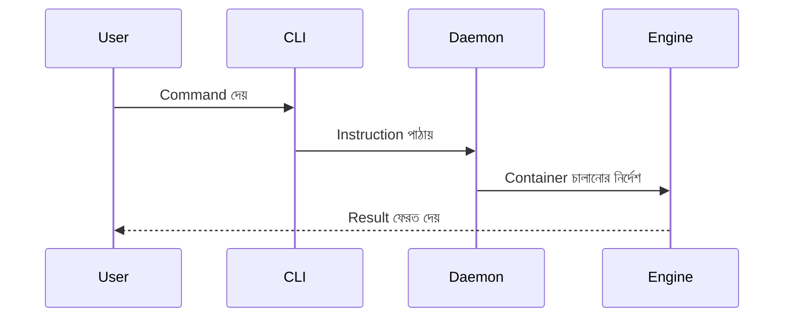

Google, Netflix, Uber—সবাই Docker ব্যবহার করে হাজার হাজার Container চালায়। Docker-এর ভিতরের তিনটি গুরুত্বপূর্ণ অংশ—Engine, CLI ও Daemon—এই লেসনে সহজভাবে জানব।

## Core Concepts

### ১. Docker Engine
- **Definition:** Docker-এর Core Service, Container চালানোর জন্য Responsible
- **Features:**
    - Image Build
    - Container Run
    - Resource Management
- **উদাহরণ:**
    - "Google-এর সার্ভারে Docker Engine হাজার হাজার Container চালায়"

### ২. Docker CLI (Command Line Interface)
- **Definition:** User Interface, Command দিয়ে Docker Engine-কে Control করা যায়
- **Features:**
    - Simple Commands: `docker run`, `docker build`, `docker ps`
    - Automation Friendly
- **উদাহরণ:**
    - "Netflix-এর DevOps টিম CLI দিয়ে Deployment Automation করে"

### ৩. Docker Daemon
- **Definition:** Background Process, Container Lifecycle Manage করে
- **Features:**
    - API Server
    - Image Pull/Push
    - Container Monitoring
- **উদাহরণ:**
    - "Uber-এর সার্ভারে Daemon Container Health Check করে"

### ৪. Workflow
1. User CLI-তে Command দেয়
2. CLI Command Daemon-এ যায়
3. Daemon Docker Engine-কে Instruction দেয়
4. Engine Container চালায়

### ৫. কেন গুরুত্বপূর্ণ?
- Efficient Resource Management
- Automation
- Scalability

### ৬. কখন ব্যবহার করবেন?
- Container Deployment
- Image Build
- Monitoring

### ৭. Common Pitfalls
- Daemon Crash
- CLI Misuse
- Resource Overload

### ৮. Best Practices
- Regular Daemon Update
- CLI Automation Script
- Resource Monitoring

### ৯. Industry Trends
- Remote Daemon
- API-based Automation
- Container Orchestration

## উদাহরণ ও এনালজি
- Docker Engine—"গাড়ির ইঞ্জিন, সবকিছু চালায়"
- CLI—"গাড়ির স্টিয়ারিং, User Control করে"
- Daemon—"গাড়ির ECU, সবকিছু মনিটর করে"

## Quick Reference
- Engine: Core Service
- CLI: User Interface
- Daemon: Background Manager

## উপসংহার

Docker Engine, CLI ও Daemon—Docker-এর ভিতরের তিনটি স্তম্ভ। সঠিকভাবে বুঝলে, Container Deployment, Automation ও Monitoring—সবকিছু সহজ ও Efficient হবে।

---

**পরবর্তী পাঠ:** ডকার ইনস্টলেশন (Linux, Mac, Windows)
